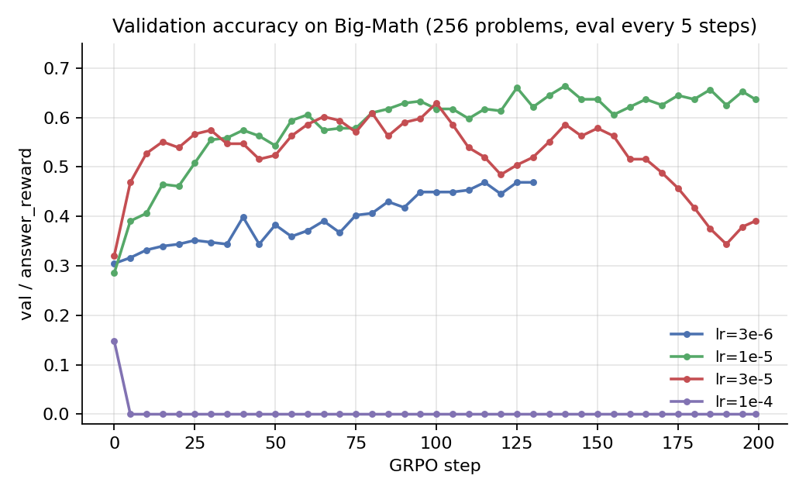
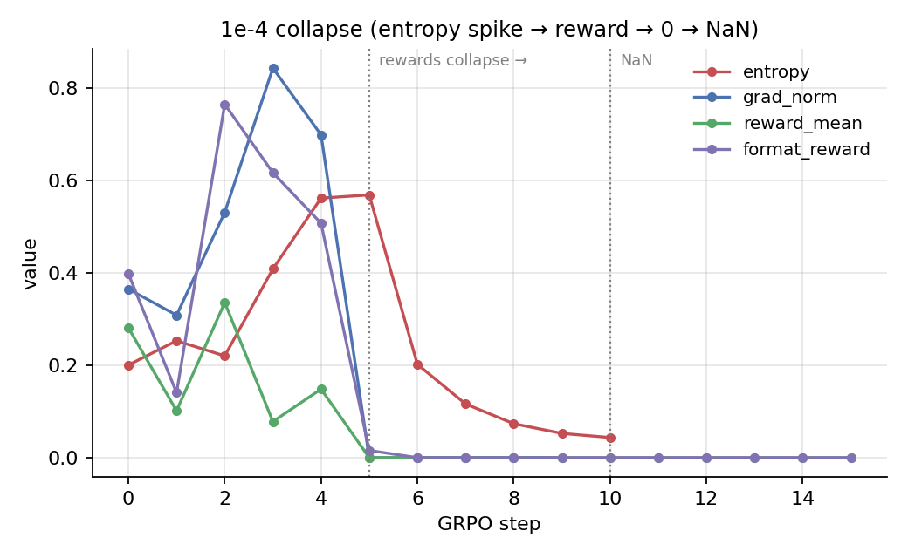
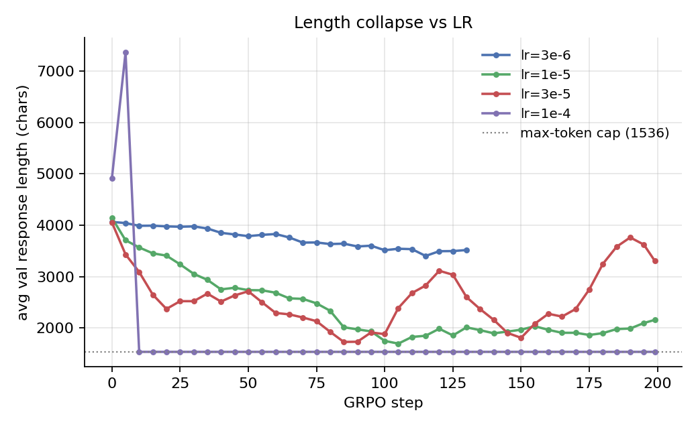
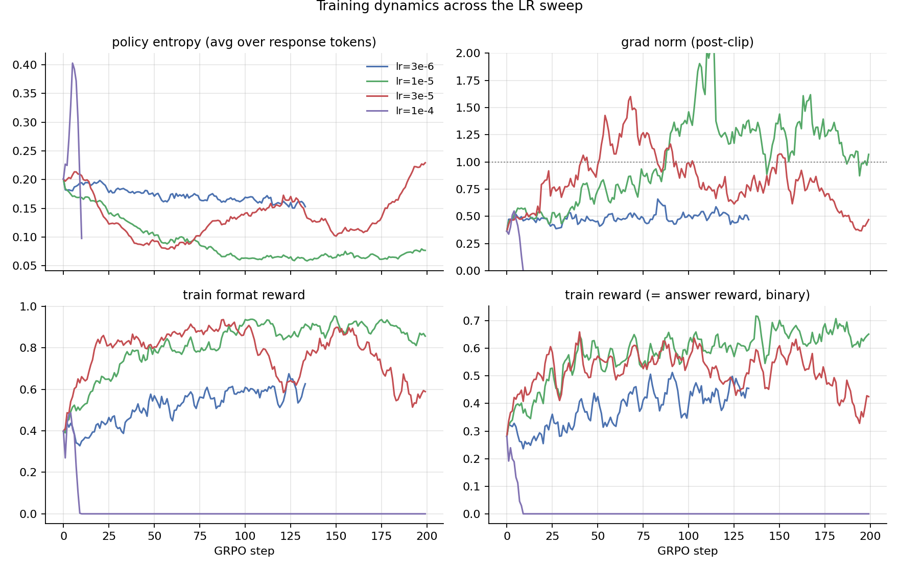
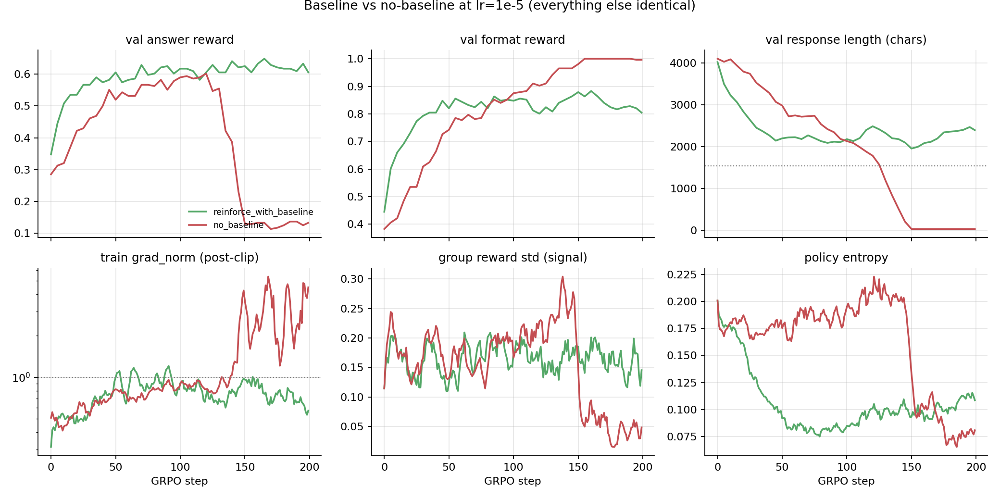
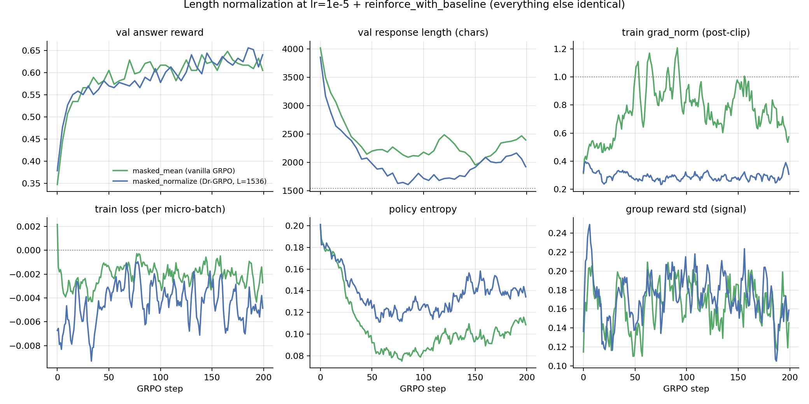
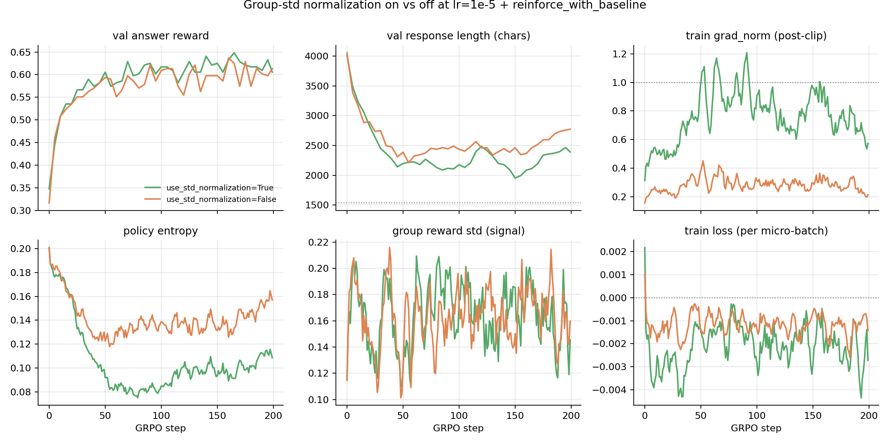

# GRPO LR sweep on Qwen3-1.7B + Big-Math: 1e-4 to 3e-6

We ran a 4-way learning-rate sweep on Qwen3-1.7B with REINFORCE-with-baseline GRPO (group_size=8, rollout/train batch 128, 1 epoch per rollout, `sampling_max_tokens=1536`, eval every 5 steps on 256 held-out problems). Everything else identical across runs — only the LR varied: `3e-6`, `1e-5`, `3e-5`, `1e-4`. Each run was given 200 steps (the `3e-6` run was killed at step 133 to free a GPU for a follow-up ablation, but it was already obviously underfit). All four ran in parallel on `cuda:0..3`.

The headline plot tells most of the story:



Final/peak val accuracy on the 256-problem held-out set:

| LR    | best val acc        | final val acc       | format reward (final) | val response length (init → final, chars) |
|-------|---------------------|---------------------|-----------------------|-------------------------------------------|
| 3e-6  | **0.469** @ step 115 | 0.469 @ step 130 *  | 0.625                 | 4064 → 3517                               |
| 1e-5  | **0.664** @ step 140 | 0.637 @ step 199    | 0.809                 | 4144 → 2158                               |
| 3e-5  | **0.629** @ step 100 | 0.391 @ step 199    | 0.715                 | 4054 → 3308                               |
| 1e-4  | **0.148** @ step 0   | 0.000 @ step 199    | 0.000                 | 4913 → 1536 (cap)                         |

\* killed at step 133.

`1e-5` is the only LR that finishes near its peak. Everything else either fails to climb (3e-6), overcooks and slides back (3e-5), or detonates immediately (1e-4).

## 1e-4: textbook policy collapse

Watching the first 15 steps of the `1e-4` run is like watching an RL training run die in slow motion:



The order is unmistakable:

1. **Entropy spikes** from 0.20 → 0.57 over four steps — the LR is too large per update, so the policy diversifies into low-quality token distributions before any consolidation.
2. **Grad norm balloons** to ~0.85 (it was hovering around 0.40 before).
3. **Reward and format reward crash to ~0** at step 5.
4. **NaN by step 10–11**, after which the model emits 1536 consecutive `!` tokens (or `---` lines) for every prompt. The policy is permanently broken.

You can see the post-collapse signature in the length plot too — `val/response_chars` snaps to exactly the max-token cap of 1536 and stays glued there:



A nice secondary tell: post-collapse rollout time per step drops by about 15% (~19.7s vs ~23.2s for healthy runs) because vLLM rolls out a deterministic, repetitive 1536-token completion much faster than diverse sampled rollouts.

## 1e-5 and 3e-5: same start, very different finish

For the first ~80 steps these two runs look almost interchangeable — `3e-5` actually leads slightly through step 100 (peak val 0.629 @ step 100 vs 1e-5's 0.595 @ step 100). Looking only at the early part of the run we'd have called `3e-5` the winner.

Then `3e-5` peaks and starts going downhill. By step 200 it's lost a quarter of its accuracy (0.629 → 0.391) and **`1e-5` is the clear winner** at 0.637 final / 0.664 best. The other panels show why:



Three secondary metrics tell the same overcooking story for `3e-5`:

- **Entropy** decays normally from 0.20 → 0.07 by step ~80, then **rises back to 0.23** by step 200 — the policy is losing coherence (red curve, top-left).
- **Grad norm** climbs from ~0.5 to repeated spikes near 2.0, hammering the `grad_clip=1.0` ceiling. Effective LR is being capped, but direction is preserved, so the policy still drifts.
- **Train reward** also peaks around step 100 at ~0.65 and slides to ~0.40 by step 200 — this isn't a val/train discrepancy, the policy is genuinely getting worse on its own training distribution.

`1e-5`, by contrast, has none of these problems. Its grad norm peaks lower (~1.5), its entropy decays monotonically to 0.075 and stays there, and its train reward keeps climbing through the end of training.

The takeaway: **the safe LR isn't the one that climbs fastest — it's the one whose curves stay monotone late in training**. If we'd stopped at step 90 we would have called `3e-5` the best, kept it, and been wrong.


## Effect of the baseline: `no_baseline` vs `reinforce_with_baseline`

The `1e-5` winner above used `loss_type=reinforce_with_baseline`, where the per-token advantage is `(reward − group_mean_reward) / group_std`. The natural ablation is to drop the per-group mean subtraction entirely (`loss_type=no_baseline`, advantage is just the std-normalized reward) and see what the baseline was actually buying us. We re-ran the exact `1e-5` recipe — same model, same data, same hyperparameters, same seed, only `loss_type` flipped — for 200 GRPO steps.



Headline: **no-baseline catastrophically collapses around step 140**, even at the LR that was rock-solid with the baseline.

| metric                 | reinforce_with_baseline | no_baseline                  |
|------------------------|-------------------------|------------------------------|
| best val answer reward | **0.648** @ step 165    | 0.602 @ step 120             |
| final val answer reward| **0.605** @ step 199    | 0.133 @ step 199             |
| final val format reward| 0.805                   | **0.996** (saturates at 1.0) |
| final val response len | 2393 chars              | **35 chars** (!)             |
| max train grad_norm    | 1.49                    | **13.4** (post-clip, log-scale plot) |
| final group_reward_std | 0.20                    | 0.05 (signal vanished)       |

Two things are happening:

1. **For the first ~120 steps the runs look broadly similar**, with no_baseline trailing reinforce_with_baseline by ~5 pp on val accuracy and being noticeably slower to learn the response format (0.38 → 0.85 over 120 steps vs the baseline's 0.45 → 0.85 over 60 steps). So even pre-collapse, the baseline is providing modest variance reduction and faster format acquisition — exactly what the textbook says it should.

2. **Around step 130–140 no_baseline falls off a cliff.** Val accuracy goes 0.60 → 0.13 in 40 steps, response length goes 1500 → 35 chars, format reward sails up to a perfect 1.0, grad norm spikes 30× to 13.4, and the per-group reward std (the GRPO "signal-strength" metric) crashes from 0.20 to 0.05.

What the rollouts actually look like at step 199 makes the failure mode obvious — every one of the 128 rollouts at step 199 is nearly the same 33-character string:

```
<think>
Okay, <answer>2</answer>
```

The policy collapsed to a degenerate "lazy format" mode: emit the opening `<think>`, a placeholder reasoning token, then a constant numeric guess. There are only 43 unique responses across 128 rollouts at step 199 (vs 128/128 unique for reinforce_with_baseline). Format reward is 1.0 because the regex parses; answer reward is ~0.1 because "2" happens to be right ~10% of the time on Big-Math.

### Why removing the baseline does this

The collapse is mechanical, not a tuning accident:

- With `reinforce_with_baseline`, advantages are mean-zero *within each group of 8 rollouts*. Some tokens get pushed up, others get pushed down, and groups where every rollout got the same reward contribute *zero* gradient. Once the policy saturates a behavior, the gradient on that behavior naturally turns off.
- With `no_baseline`, advantages are just `reward/std` ≥ 0. Every "successful" trajectory unconditionally reinforces *every* token it emitted. Combined with the standard `masked_mean` per-token loss weighting (Σ over response tokens / num_response_tokens — already discussed in the length-compression section above), **shorter format-correct trajectories get a larger per-token gradient than longer ones**, and there's no negative signal to balance it out.
- That gives a steady positive-feedback loop pushing toward "shortest possible format-valid output". The model finds the local minimum (`<think>\nOkay, <answer>X</answer>`) and hammers it. Once that mode locks in, every group has near-identical rewards, group reward std collapses to ~0.05, the advantage signal vanishes, and the policy can't dig itself back out.
- The grad-norm spike to 13.4 at step ~145 is the visible convulsion as the policy commits to the lazy mode. After that, the policy is stuck and grad norm decays back down.

### Other things

- `group_reward_std_mean` (the average per-prompt reward std across the 8 rollouts) holds at 0.17–0.20 throughout for healthy runs. That's the signal-strength metric — when it collapses to ~0, advantages vanish and learning stalls. That's exactly what happens to `1e-4` after step 5.

## Effect of length normalization: `masked_mean` vs `masked_normalize` (Dr-GRPO)

Same setup as the baseline ablation — keep `loss_type=reinforce_with_baseline`, `lr=1e-5`, same model, same data, same seed, 200 steps — and swap *only* the per-sequence aggregation. Vanilla GRPO uses `masked_mean` (Σ over response tokens / N_response_tokens); Dr-GRPO replaces it with `masked_normalize` and a fixed `normalize_constant=L_max=1536` (Σ over response tokens / L_max).



Headline numbers:

| metric                   | masked_mean (vanilla)     | masked_normalize (Dr-GRPO) |
|--------------------------|---------------------------|----------------------------|
| best val answer reward   | 0.648 @ step 165          | **0.656** @ step 185       |
| final val answer reward  | 0.605                     | **0.641**                  |
| max train grad_norm      | **1.49** (hits clip)      | 0.52 (never near clip)     |
| final train grad_norm    | 0.65                      | **0.31**                   |
| final train entropy      | 0.094                     | **0.117** (more retained)  |
| final val response chars | 2393                      | 1921                       |

### The big effect is on stability, not on score

Val accuracy is essentially a tie — drnorm wins by ~3 pp at the end and is still climbing while masked_mean has plateaued, but at this scale the run-to-run noise on val/answer_reward is roughly that big. **The dramatic difference shows up in the gradient panel** (top-right):

- **Grad norm is ~3× smaller and far smoother under drnorm.** masked_mean wanders 0.4–1.5 and bumps into the `grad_clip=1.0` ceiling repeatedly between steps 60 and 180 (peak 1.49). drnorm sits in a narrow 0.2–0.5 band the entire run and never gets within 2× of the clip. At `lr=1e-5` with masked_mean a meaningful fraction of updates are getting silently capped; under drnorm, the optimizer is operating in the regime it's actually configured for.

- **Entropy decays less aggressively under drnorm** (0.20 → 0.12 by step 100 vs 0.20 → 0.08 for masked_mean) and stays *higher* throughout the second half. Consistent with the smaller effective LR: slower entropy decay means the policy preserves more sampling diversity, which probably also explains why drnorm is still trending up at step 200 while masked_mean has flattened.


## Effect of group-std normalization: `use_std_normalization` on vs off

The third loss-shape ablation. Same recipe as before — `loss_type=reinforce_with_baseline`, `lr=1e-5`, `length_normalization=masked_mean`, same model, data, seed — flip *only* `use_std_normalization` from `True` to `False`. With it on, the advantage is `(reward − group_mean) / (group_std + eps)` (the standard GRPO recipe). With it off, the advantage is just `(reward − group_mean)`.



Headline numbers:

| metric                   | std_norm ON (default)     | std_norm OFF              |
|--------------------------|---------------------------|---------------------------|
| best val answer reward   | **0.648** @ step 165      | 0.637 @ step 160          |
| final val answer reward  | 0.605                     | **0.613**                 |
| max train grad_norm      | **1.49** (hits clip)      | 0.76 (never near clip)    |
| final train grad_norm    | 0.65                      | **0.22**                  |
| final train entropy      | 0.094                     | **0.139** (more retained) |
| final val response chars | 2393                      | 2773 (less compression)   |
| advantage std (all rollouts) | 0.59                  | **0.26**                  |
| advantage max(|·|)       | 2.47                      | **0.875**                 |

### Same story as length normalization: it's a stability lever in score's clothing

Val accuracy is again a tie within seed-noise (std_off final 0.613 vs std_on final 0.605; std_on's peak 0.648 vs std_off's 0.637 — ~1pp either way). Everything else is markedly different:

- **Grad norm is ~2× smaller and ~2× smoother with std_norm OFF.** std_on wanders 0.4–1.5 and bumps the `grad_clip=1.0` ceiling repeatedly between steps 60–180 (peak 1.49). std_off sits in a tight 0.15–0.5 band the entire run — it never gets within 2× of the clip. The factor of two falls right out of the advantage-distribution numbers below.
- **Train loss has visibly lower variance** with std_off and centers slightly closer to zero. Both are mean-zero by construction (the baseline is doing that work, not the std-norm), but std_off's per-microbatch loss has clearly smaller excursions.
- **Entropy is dramatically better preserved with std_off** (0.20 → 0.14 vs 0.20 → 0.094 by step 100) and even *rises slightly* in the second half toward 0.16 — without that signal also coinciding with collapse signs (group_reward_std stays healthy, val keeps rising), the entropy bump here is benign and just reflects the smaller per-update step. With std_on the entropy collapse is much steeper, consistent with the larger effective updates.

## Repro

- Sweep launcher: `train_scripts/lr_sweep/sweep.sh` (`bash sweep.sh` parallel-launches all 4 LRs on `cuda:0..3`).
- Per-LR wrappers: `train_scripts/lr_sweep/run_qwen3_bigMath_<lr>.sh`.
- Shared base: `train_scripts/lr_sweep/_base.sh` — single source of truth for hyperparameters.
- Metrics: `runs/grpo_qwen3_bigmath_lr<lr>/metrics.jsonl`; full per-rollout dumps at `runs/.../rollouts.jsonl`.
- Figures: regenerate with `uv run python blog/make_figs.py`.
