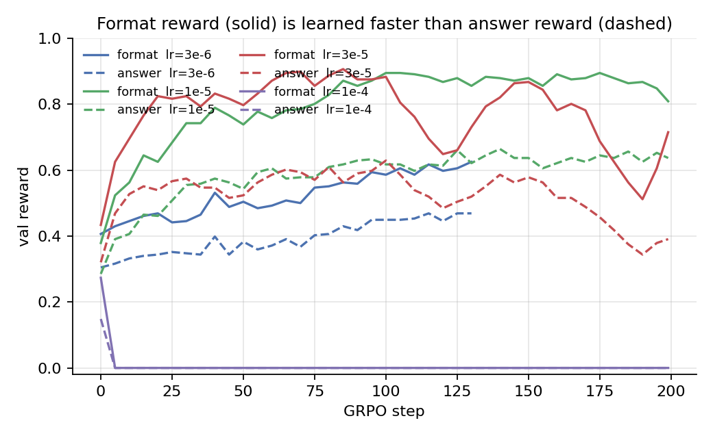

# GRPO LR sweep on Qwen3-1.7B + Big-Math: 1e-4 to 3e-6

We ran a 4-way learning-rate sweep on Qwen3-1.7B with REINFORCE-with-baseline GRPO (group_size=8, rollout/train batch 128, 1 epoch per rollout, `sampling_max_tokens=1536`, eval every 5 steps on 256 held-out problems). Everything else identical across runs — only the LR varied: `3e-6`, `1e-5`, `3e-5`, `1e-4`. Each run was given 200 steps (the `3e-6` run was killed at step 133 to free a GPU for a follow-up ablation, but it was already obviously underfit). All four ran in parallel on `cuda:0..3`.

The headline plot tells most of the story:

Final/peak val accuracy on the 256-problem held-out set:

| LR    | best val acc        | final val acc       | format reward (final) | val response length (init → final, chars) |
|-------|---------------------|---------------------|-----------------------|-------------------------------------------|
| 3e-6  | **0.469** @ step 115 | 0.469 @ step 130 *  | 0.625                 | 4064 → 3517                               |
| 1e-5  | **0.664** @ step 140 | 0.637 @ step 199    | 0.809                 | 4144 → 2158                               |
| 3e-5  | **0.629** @ step 100 | 0.391 @ step 199    | 0.715                 | 4054 → 3308                               |
| 1e-4  | **0.148** @ step 0   | 0.000 @ step 199    | 0.000                 | 4913 → 1536 (cap)                         |

\* killed at step 133.

`1e-5` is the only LR that finishes near its peak. Everything else either fails to climb (3e-6), overcooks and slides back (3e-5), or detonates immediately (1e-4).

## 1e-4: textbook policy collapse

Watching the first 15 steps of the `1e-4` run is like watching an RL training run die in slow motion:

The order is unmistakable:

1. **Entropy spikes** from 0.20 → 0.57 over four steps — the LR is too large per update, so the policy diversifies into low-quality token distributions before any consolidation.
2. **Grad norm balloons** to ~0.85 (it was hovering around 0.40 before).
3. **Reward and format reward crash to ~0** at step 5.
4. **NaN by step 10–11**, after which the model emits 1536 consecutive `!` tokens (or `---` lines) for every prompt. The policy is permanently broken.

You can see the post-collapse signature in the length plot too — `val/response_chars` snaps to exactly the max-token cap of 1536 and stays glued there:

A nice secondary tell: post-collapse rollout time per step drops by about 15% (~19.7s vs ~23.2s for healthy runs) because vLLM rolls out a deterministic, repetitive 1536-token completion much faster than diverse sampled rollouts.

## 1e-5 and 3e-5: same start, very different finish

For the first ~80 steps these two runs look almost interchangeable — `3e-5` actually leads slightly through step 100 (peak val 0.629 @ step 100 vs 1e-5's 0.595 @ step 100). Looking only at the early part of the run we'd have called `3e-5` the winner.

Then `3e-5` peaks and starts going downhill. By step 200 it's lost a quarter of its accuracy (0.629 → 0.391) and **`1e-5` is the clear winner** at 0.637 final / 0.664 best. The other panels show why:

Three secondary metrics tell the same overcooking story for `3e-5`:

- **Entropy** decays normally from 0.20 → 0.07 by step ~80, then **rises back to 0.23** by step 200 — the policy is losing coherence (red curve, top-left).
- **Grad norm** climbs from ~0.5 to repeated spikes near 2.0, hammering the `grad_clip=1.0` ceiling. Effective LR is being capped, but direction is preserved, so the policy still drifts.
- **Train reward** also peaks around step 100 at ~0.65 and slides to ~0.40 by step 200 — this isn't a val/train discrepancy, the policy is genuinely getting worse on its own training distribution.

`1e-5`, by contrast, has none of these problems. Its grad norm peaks lower (~1.5), its entropy decays monotonically to 0.075 and stays there, and its train reward keeps climbing through the end of training.

The takeaway: **the safe LR isn't the one that climbs fastest — it's the one whose curves stay monotone late in training**. If we'd stopped at step 90 we would have called `3e-5` the best, kept it, and been wrong.

## Format is learned much faster than answer correctness

Because reward is binary `{0, 1}` and gated on both the `</think>...<answer>...</answer>` wrapping *and* the math being right, we can split val performance into "got the format right" and "got the answer right" components:

Across all healthy runs the format reward (solid lines) jumps fast and saturates well before the answer reward (dashed lines). At the end:

- 1e-5: format 0.81, answer 0.64 (gap 0.17)
- 3e-5: format 0.72, answer 0.39 (gap 0.33 — gap *grew* as the policy degraded)
- 3e-6: format 0.63, answer 0.47 (gap 0.16, but both still rising)

This "first learn the protocol, then learn the math" curriculum shows up across every reasonable LR and is a useful sanity check — if format isn't crossing 0.6 quickly something is structurally wrong (template, tokenizer, or reward parser).

## The length-compression side effect

Both `1e-5` and `3e-5` shrink val response length by **~50%** over training (4144 → 2158 chars for 1e-5; for 3e-5 the length actually rebounds to 3308 by step 200 as it loses coherence). `3e-6` barely compresses (4064 → 3517).

Reward is purely terminal, so shorter-but-correct CoTs aren't *directly* incentivized — but the standard GRPO recipe uses `masked_mean` (`Σ over response tokens / num_response_tokens`) which weights every sequence equally regardless of length. That implicitly favors shorter rollouts: a correct 200-token CoT gets the same per-sequence loss weight as a correct 1500-token CoT, but contributes 7.5× more *per-token* gradient. Combined with `reinforce_with_baseline`'s mean-zero advantage shape, this gives the policy a steady push toward terser reasoning. Dr-GRPO's `Σ / L_max` length normalization removes this bias; we're following up with an ablation that swaps in `masked_normalize`.

The really interesting thing in the length plot is the `3e-5` run's late rebound from 1700 → 3700 chars between steps 100 and 200 — that mirrors the entropy bump and the reward decay, and is a third independent signal that the policy is breaking down.

## Other small things worth knowing

- `clip_fraction` is identically 0 across all runs, which is the expected sanity check for `reinforce_with_baseline` (no PPO ratio clipping). The `cliprange=0.2` setting only matters for `loss_type=grpo_clip`.
- `group_reward_std_mean` (the average per-prompt reward std across the 8 rollouts) holds at 0.17–0.20 throughout for healthy runs. That's the signal-strength metric — when it collapses to ~0, advantages vanish and learning stalls. That's exactly what happens to `1e-4` after step 5.
- The grader had a Unicode bug — answers like `1.656×10⁶` (Unicode superscript) were getting 0 reward against ground truth `1.656×10^{6}` because `_normalize` never folded `⁶` to `^6`. We patched it (recovers ~70 false-negatives across the existing rollout logs) but the patch only affects future training; the historical reward/advantage values used for the gradients above were the pre-patch ones. The numbers in this post would presumably nudge slightly upward with the fixed grader, but the *ordering* across LRs would not change.

## Recommendations for follow-ups

1. **Run length budget**: 200 steps is enough to see overcook on `3e-5` and steady progress on `1e-5`. If we want a final number we should give `1e-5` another 100–200 steps and watch for the same overcook signature.
2. **Grad clip is binding**: at `1e-5` and `3e-5` the grad norm is regularly at the 1.0 cap. Raising `grad_clip` to ~2.0 might give us actual headroom; right now nominal LR increases above `1e-5` are partly being eaten by the clip.
3. **Early-warning monitor**: `train/token_entropy > 2× initial for 3 consecutive steps` would have killed the `1e-4` run by step 4 instead of letting it burn 200 steps of compute. Same idea for `train/token_entropy` *rising* late in training (the `3e-5` overcook would have triggered around step 120).
4. **Eval cadence**: `eval_every=5` means the first sign of `1e-4`'s collapse in val didn't show up until step 5, when the policy was already broken. For new sweep configs, the first 10 steps should be eval'd every step.
5. **Length normalization**: the systematic length compression at higher LRs is a real nuisance. The follow-up loss-type ablation (mean vs sum-with-Lmax; baseline vs no-baseline; std-norm on/off) is currently running on `cuda:4..7`.

## Repro

- Sweep launcher: `train_scripts/lr_sweep/sweep.sh` (`bash sweep.sh` parallel-launches all 4 LRs on `cuda:0..3`).
- Per-LR wrappers: `train_scripts/lr_sweep/run_qwen3_bigMath_<lr>.sh`.
- Shared base: `train_scripts/lr_sweep/_base.sh` — single source of truth for hyperparameters.
- Metrics: `runs/grpo_qwen3_bigmath_lr<lr>/metrics.jsonl`; full per-rollout dumps at `runs/.../rollouts.jsonl`.
- Figures: regenerate with `uv run python blog/make_figs.py`.
